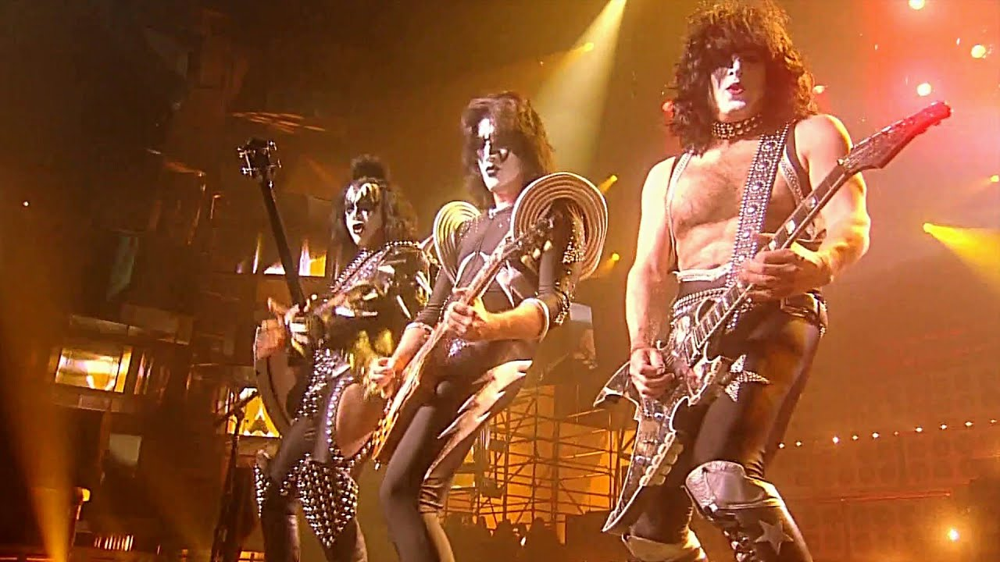
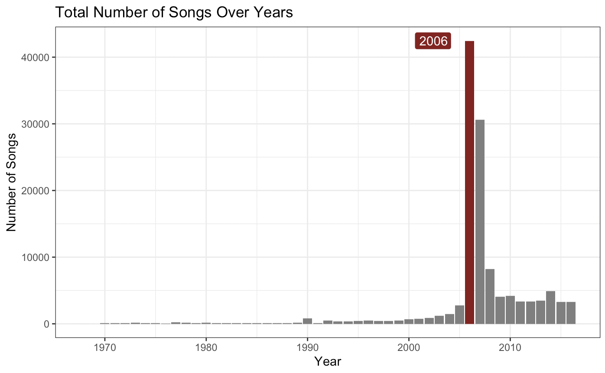
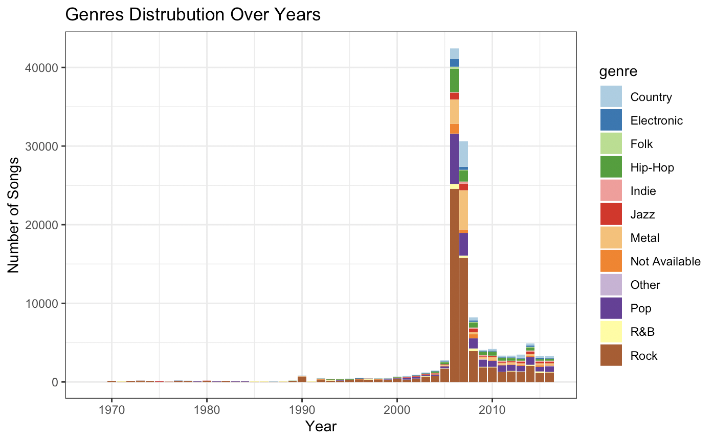
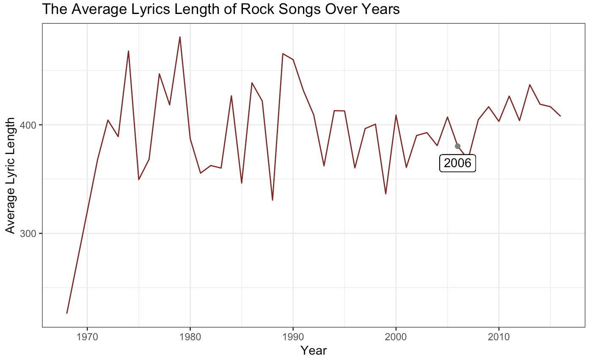
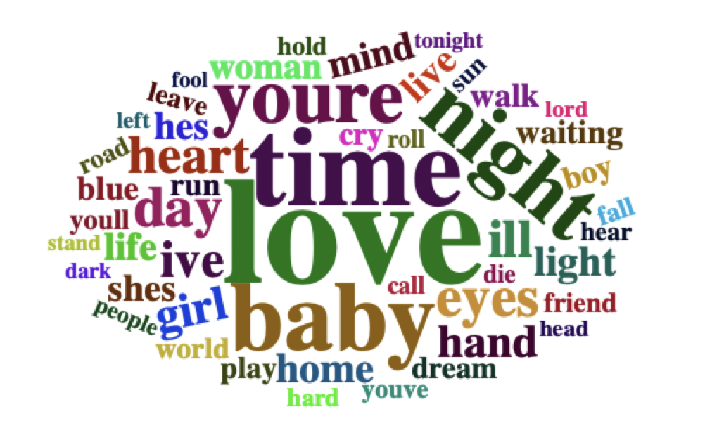
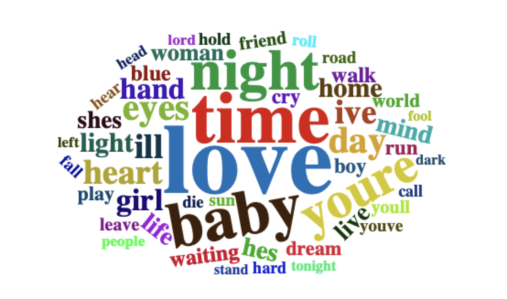
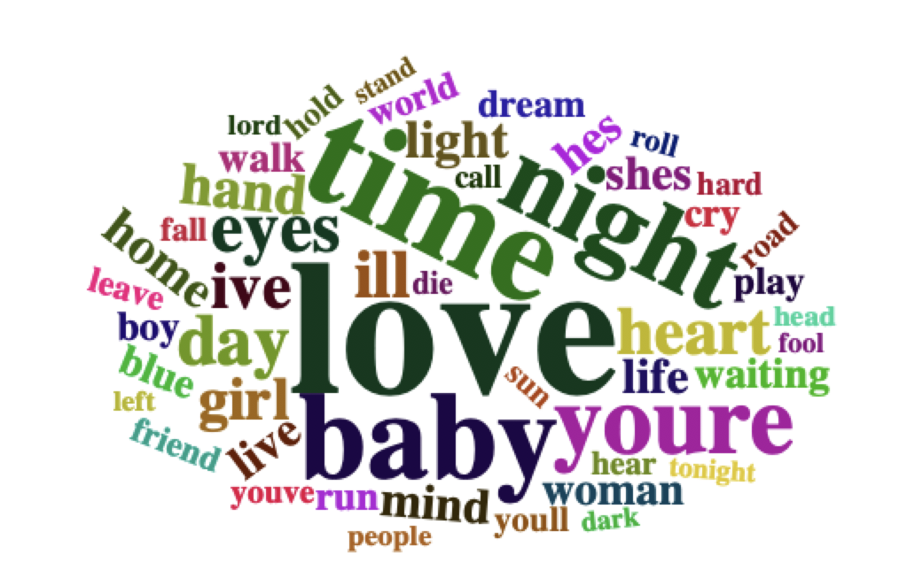

# Applied Data Science
## Fall 2019
## Project 1: Rock Stars over the Years

Nowadays, in a society of popstars and idols who sing soft and beautiful music, it seems like the time when we wear crazy hair, leather jackets, heavy eyeliner has passed. Over the years, have the passion of artists decreased? Have the feelings of the lyrics soften? 

### The Dataset

The dataset was collected from a lyrics website that was created in 2002. The datasets includes 125,000 songs in 12 genres. The first barplot shows the distribution of total number of songs in each year in this dataset, and year 2006 shows a great difference. Uncertain of the accuracy of the total number of songs each year in the dataset in reflection of the real world. But in 2006, the spread of digital media and expansion of Wireless internet could possibly increased the number of songs accessed by the website. 

This stacked bar graph have shown the distribution of the 12 genres in each year, and it is quite obvious that rock songs have occupied the majority of the songs in each year. 

### Rock Song Lyrics

#### The Average Length

There is an overall decreasing trend of the length of lyrics in rock music over the years. Notice that in the year 2006, the time that has the most total number of songs, the average of the length of the lyrics in rock music is comparatively short. There seem to have a weak negative relation between the total number of songs in each year, and the average length of the lyrics. 

#### The Common Words

From the distribution of the number of songs, I have selected four years that are most representitive: 1970, 1990, 2006, and 2016. Here are the most common first words in the lyrics at these times:

##### 1970:

##### 1990:

##### 2006:

##### 2016:

In comparison, there are some words changed, but the most common ones remain: Love, Time, Baby.

#### Summary

The world changed a lot in the past 5 decades. The number of artists changed and the number of songs in each genres changed. But from the dataset we have, we can see that within Rock music itself, not much changed. 

